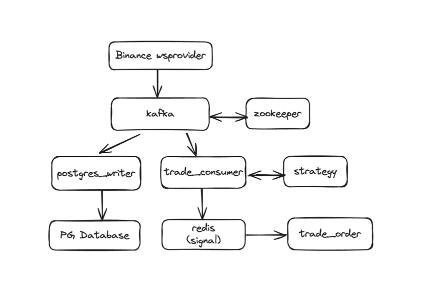

# Simple-Trading

一个简单的 Kafka Based Trading System in Python

## Infra


> 1.binance_wsprovider 通过币安的 wss stream 获取数据，发送到Kafka。  
> 2.postgres_writer 从 Kafka 读取数据，写入 PG Database。  
> 3.trade_consumer 也从 Kafka 读取数据，维护好 dataframe ，然后定时触发计算逻辑（逻辑从 strategy*.py ），将得到的 signal 存入 redis。  
> 4.trade_order 定时监控redis上的signal，然后在有效 signal 里 rank top 1，模拟发送订单交易。  


## Test Environment
```
Tencent Cloud VM - HongKong Region
Ubuntu Server 20.04 LTS 64bit
2C 4G 80G SSD
预装 Git Docker Docker-Compose
```

## Quick Start
### Step1. Clone this project to local
```shell
$ git clone https://github.com/xu747/simple-trading.git
```
### Step2. build
注意：如果在US执行，需要在build前先修改simple_trading_config.py的wss链接。
```shell
$ cd simple-trading/ && docker compose build
```
如果build中出现问题，一般是网络问题，尝试重试。
### Step3. run
```shell
$ docker compose up -d
```
如果运行正常 应该返回
```shell
[+] Running 8/9
 ⠋ Network simple-trading_default                 Created
 ✔ Container simple-trading-postgres-1            Started
 ✔ Container simple-trading-zookeeper-1           Started
 ✔ Container simple-trading-redis-1               Started
 ✔ Container simple-trading-kafka-1               Started
 ✔ Container simple-trading-binance_wsprovider-1  Started
 ✔ Container simple-trading-postgres_writer-1     Started
 ✔ Container simple-trading-trade_consumer-1      Started
 ✔ Container simple-trading-trade_order-1         Started
```
然后再检查一下容器有没有都起来
```shell
ubuntu@tx-hk-1:~/simple-trading$ docker ps -a
CONTAINER ID   IMAGE                               COMMAND                  CREATED              STATUS              PORTS                                                             NAMES
e57977e47dd5   simple-trading-trade_order          "python trade_order.…"   About a minute ago   Up About a minute                                                                     simple-trading-trade_order-1
a56b4b311792   simple-trading-postgres_writer      "python postgres_wri…"   About a minute ago   Up About a minute                                                                     simple-trading-postgres_writer-1
1def257d5672   simple-trading-binance_wsprovider   "python binance_wspr…"   About a minute ago   Up About a minute                                                                     simple-trading-binance_wsprovider-1
e5121e13c69f   simple-trading-trade_consumer       "python trade_consum…"   About a minute ago   Up About a minute                                                                     simple-trading-trade_consumer-1
e7ca297efded   confluentinc/cp-kafka:7.4.4         "/etc/confluent/dock…"   About a minute ago   Up About a minute   9092/tcp, 0.0.0.0:29092->29092/tcp, :::29092->29092/tcp           simple-trading-kafka-1
45c6825eea61   postgres:16                         "docker-entrypoint.s…"   About a minute ago   Up About a minute   5432/tcp                                                          simple-trading-postgres-1
2fbda346892c   confluentinc/cp-zookeeper:7.4.4     "/etc/confluent/dock…"   About a minute ago   Up About a minute   2888/tcp, 3888/tcp, 0.0.0.0:22181->2181/tcp, :::22181->2181/tcp   simple-trading-zookeeper-1
d6faa30a01e5   redis:latest                        "docker-entrypoint.s…"   About a minute ago   Up About a minute   0.0.0.0:6379->6379/tcp, :::6379->6379/tcp                         simple-trading-redis-1
```
### Step4.See results  
一般先等待集群运行一、二分钟左右，然后开始查看四个容器的运行情况/结果。  
下面按序查看四个容器的运行情况。
#### 1.Producer: binance_wsprovider
如果正常运行，能看到从币安收到每秒的tick（各币种）的日志和发送到kafka的日志。
```shell
ubuntu@tx-hk-1:~/simple-trading$ docker logs -f -n 1 simple-trading-binance_wsprovider-1
```
```shell
DEBUG:root:Received message from binance: {"e":"24hrTicker","E":1711123991960,"s":"BNBUSDT","p":"-3.90000000","P":"-0.699","w":"564.71999716","x":"557.80000000","c":"553.80000000","Q":"0.22400000","b":"553.70000000","B":"54.24000000","a":"553.80000000","A":"29.81500000","o":"557.70000000","h":"588.10000000","l":"541.70000000","v":"1181388.68200000","q":"667153813.14420000","O":1711037591959,"C":1711123991959,"F":731312476,"L":732024572,"n":712097}
DEBUG:root:Sent message to kafka: {"e":"24hrTicker","E":1711123991960,"s":"BNBUSDT","p":"-3.90000000","P":"-0.699","w":"564.71999716","x":"557.80000000","c":"553.80000000","Q":"0.22400000","b":"553.70000000","B":"54.24000000","a":"553.80000000","A":"29.81500000","o":"557.70000000","h":"588.10000000","l":"541.70000000","v":"1181388.68200000","q":"667153813.14420000","O":1711037591959,"C":1711123991959,"F":731312476,"L":732024572,"n":712097}
```

#### 2.Consumer1: postgres_writer
如果正常运行，能看到价格信息写入PG的成功日志。  
如果要进一步查看，可以进到容器里面用psql来count表行数。
```shell
ubuntu@tx-hk-1:~/simple-trading$ docker logs -f -n 1 simple-trading-postgres_writer-1
```
```shell
DEBUG:root:Successfully Stored Symbol[ETHUSDT] price[3329.03] timestamp[1711124291648] To PG
DEBUG:root:Successfully Stored Symbol[BNBUSDT] price[552.3] timestamp[1711124292300] To PG
DEBUG:root:Successfully Stored Symbol[BTCUSDT] price[63511.18] timestamp[1711124292597] To PG
DEBUG:root:Successfully Stored Symbol[ETHUSDT] price[3328.73] timestamp[1711124292629] To PG
```

#### 3.Consumer2: trade_consumer
如果正常运行，能看到从Kakfa收到的价格的日志，以及定时更新指标的日志。
```shell
ubuntu@tx-hk-1:~/simple-trading$ docker logs -f -n 1 simple-trading-trade_consumer-1
```
```shell
DEBUG:root:Get new data, symbol: ETHUSDT, price: 3324.46000000, timestamp: 2024-03-22 16:20:36.638000
DEBUG:root:Get new data, symbol: BNBUSDT, price: 551.10000000, timestamp: 2024-03-22 16:20:37.273000
DEBUG:root:Get new data, symbol: BTCUSDT, price: 63424.92000000, timestamp: 2024-03-22 16:20:37.683000
DEBUG:root:Updating signal for BTCUSDT
DEBUG:root:symbol: BTCUSDT, signal: -143.9039504260239
DEBUG:root:Updating signal for ETHUSDT
DEBUG:root:symbol: ETHUSDT, signal: -134.08190224570504
DEBUG:root:Updating signal for BNBUSDT
DEBUG:root:symbol: BNBUSDT, signal: -96.07843137254822
```

#### 4.trade_order
如果正常运行，能看到从redis定时读取的指标的日志，以及下/不下单的日志。
```shell
ubuntu@tx-hk-1:~/simple-trading$ docker logs -f -n 1 simple-trading-trade_order-1
```
```shell
INFO:root:Signals stored in Redis ZSET:
INFO:root:BTCUSDT: 38.861651448988326
INFO:root:ETHUSDT: 42.590361445785106
INFO:root:BNBUSDT: 44.07407407407595
INFO:root:Symbol: BNBUSDT, Signal: 44.07407407407595 is current max. Choose this one to send order
INFO:root:Simulate sending order to binance, symbol: b'BNBUSDT'
INFO:root:Simulate success sending order to binance, symbol: b'BNBUSDT'
```

## TOP FAQ
### 1.How to make the system run in different envs?
> 使用 Docker 和 Docker-Compose
### 2.How to manage the package dependencies in Python?
> 我的办法是将所有的模块拆开，分别用不同容器打包。  
> 每个容器内部都有独立的 requirements.txt，在 docker build 的时候用pip安装。
### 3.如果要增加币种or指标，应该怎样处理?
> 增加币种：由于项目在设计的时候做了优化，只需修改设置，无需动代码。  
> 在config文件的SYMBOLS加入币种（币安上有的），重启后会自适应。  

> 增加信号：增加指标相对增加币种要复杂一些。但由于已经将 trade_consumer 和 strategy 拆开，主要也是在 strategy 里面增加。  
> 具体的步骤是：
> 1. 在config文件的SIGNAL_TYPES加入新的 signal。
> 2. 在 strategy_signal.py 里面实现 新的 signal。如果需要新的指标，增加 strategy_indicator_*.py 文件。(dataframe里已经存储全量的tick信息，供实现新的策略使用)
> 3. 在 strategy_signal.py 修改 get_signal 函数以加入新的 SIGNAL_TYPE。
> 4. 对 trade_order 进行多 signal 改造（如需）。  
> P.S. trade_consumer.py 在设计的时候已经支持了多 signal，无需特殊修改。


